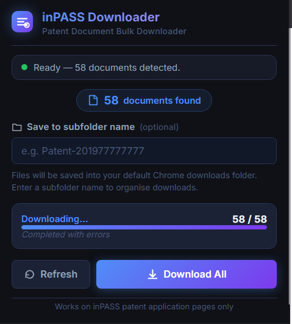

# inPASS Bulk Document Downloader — Chrome Extension

A browser extension that bulk-downloads all patent documents listed on an **inPASS** (Indian Patent Advanced Search System) application page, saving each file with its exact name as shown on the website.

---

## Screenshot



---

## Features
- ✅ Auto-detects all documents on the current inPASS application page
- ✅ Downloads all documents into a single ZIP archive
- ✅ Files saved with **exact filenames** from the website
- ✅ Optional **subfolder name** to organise downloads
- ✅ Live **progress counter** (e.g. 3 / 18)
- ✅ Per-file **success / error log** in the popup

---

## Installation (Developer Mode)

### Step 1: Download the Extension
Clone or download this repository to your computer:
```bash
git clone https://github.com/rohitlee/inPASS-downloader.git
cd inPASS-downloader
```

Or manually download the ZIP and extract it.

### Step 2: Open Chrome Extensions Page
1. Open **Google Chrome** (or any Chromium-based browser like Brave, Edge)
2. Type `chrome://extensions/` in the address bar and press Enter

### Step 3: Enable Developer Mode
- Look for the **Developer mode** toggle in the **top-right corner** of the extensions page
- Click it to turn it **ON** (it will turn blue)

### Step 4: Load the Extension
1. Click **Load unpacked** (appears after enabling Developer mode)
2. **Navigate to the folder** where you cloned/extracted the repository
3. Select the folder containing `manifest.json` (the root `inPASS-downloader` folder)
4. Click **Select Folder**

### Step 5: Verify Installation
- The extension icon will appear in your Chrome toolbar (top-right)
- You should see "inPASS Document Downloader" in the extensions list
- If it shows a warning, that's normal for unpacked extensions

---

## How to Use

### Step-by-Step Guide

1. **Visit inPASS and Log In**
   - Go to https://iprsearch.ipindia.gov.in/
   - Log in with your credentials
   - Complete the CAPTCHA if prompted
   - Navigate to a specific **patent application** to view its documents

2. **Open the Extension Popup**
   - Click the **inPASS Downloader** icon in your Chrome toolbar (top-right)
   - The popup will automatically scan the page and show how many documents it found

3. **Enter Subfolder Name (Optional)**
   - If you want to organize downloads into a subfolder, enter a name like:
     - `Patent-201977777777`
     - `My Patents`
     - `Batch-01`
   - The files will be saved into a subfolder in your default Chrome Downloads folder
   - Leave blank to save directly to Downloads

4. **Start Download**
   - Click the **Download All** button
   - The extension will:
     - Fetch all documents sequentially (one at a time, to avoid server overload)
     - Combine them into a single **ZIP file**
     - Save the ZIP to your Downloads folder
     - Show progress in real-time (e.g., "5 / 18")

5. **Save the ZIP File**
   - A **Save As** dialog will appear
   - Choose where to save (Downloads folder is recommended)
   - Click **Save**

6. **Extract and Use**
   - Once saved, right-click the ZIP file and select **Extract All**
   - All your documents will be extracted with their original filenames

---

## How It Works

| Step | What happens |
|---|---|
| Scan | Content script finds all `<button name="DocumentName">` elements |
| Fetch | For each button, content.js POSTs the form (with your session cookies) to get the PDF |
| Save | Background service worker calls `chrome.downloads.download()` with the exact filename |
| Progress | Each result is reported back to the popup in real-time |

---

## Privacy & Security

- No data collection
- No analytics or tracking
- No external servers
- Runs entirely locally in the browser
- Only accesses the currently open inPASS page
- Does not bypass authentication or CAPTCHA

---

## Permissions Used

| Permission | Why |
|---|---|
| `downloads` | To save files with specific filenames |
| `activeTab` | To read the current page |
| `scripting` | To run content scripts on demand |
| `storage` | To remember your subfolder preference |

---

## Notes

- This extension only works on **inPASS application document list pages**.
- You must already be logged in / past the CAPTCHA — the extension reuses your browser session.
- Files are saved to your **Chrome default Downloads folder** (optionally in a named subfolder).
- To change the default Downloads location, update it in Chrome Settings → Downloads.
- The Refresh button clears the log and resets download state

---

## Disclaimer

This project is an independent open-source utility and is not affiliated with, endorsed by, or associated with the Indian Patent Office or the Government of India.

This tool only assists with downloading documents already accessible to the logged-in user through the inPASS portal.
